# The Money Manager
http://mishals-money-manager.herokuapp.com/

An app that will allow a user to keep track of their money in a realistic
way. Expenditure is divided into overheads and extras, income divided into
taxeable and non-taxeable income. The app will then calculate what actual
disposable income the user has, as well as how much to set aside for taxes.
A suggested savings of 20% is included, as per conventional good financial
sense.

There will be different constant sums for the app, for example:

- total credit
- total monthly expenditure
- total monthly income
- total monthly tax to pay
- suggested savings amount

There will be a wishlist area that stores links to desired products, and keeps 
track of when you have enough extra money to buy it.

The ideal user is a freelancer who has relatively simple finances and a young
business she is nurturing. While they aren't terrible with money, they may not
be good at keeping track of what their financial standing is.

# Primary Abstract Features

- Freelancers typically experience a "feast or famine" situation and it is
  always advised to keep some capital extra on the side for the "famine" months.
  One of the features of the app is to help the user protect themselves from 
  being too comfortable during a "feast" stage and overspending.

- At the moment when an expansion/investment decision is to be made, the user
  has the opportunity to be certain of their situation financially.

- The user can refer to the past months of financial activity and keep track
  of their own pattern, helping them make better decisions overall.

## Practical Features

- A clear, simple user interface that makes daily financial discipline less
  of a chore.

- A general dashboard that gives basic feedback, primarily "Total Credit" and
  "Disposable Income".

- A more detailed page where the user can see more endpoints, such as "amount
  spent this month on bills", "income from invoices", "pending invoices"

- A reward system that makes using the app a pleasure, such as images that 
  remind the user of a financial goal. For example, the user may have the wish 
  to earn enough as a freelancer to live in Bali and work from a laptop. She 
  can then upload an image of a person on a Balinese beach typing on a nice 
  MacBook air.

- An archive of past months finances.

## Limiting the scope of the app

Due to the complex way in which personal finances can work, this app can be
set up for a person on a normal job contract who wishes to keep track of
their expenses and save up for, for example, a new motorbike.

However, I had the idea to create a corresponding feature which would
push the figures to an Google Spreadsheet to make tax season easier. While the
feature may well be built in the future, I felt it would be
beyond the scope of this app. This is due to the possibility of a user who is,
as mentioned in the previous paragraph, on a contract and has a different
setup, financially.

## Notes on the README approach

Previously there was some difficulty with creating a useful README. In earlier
projects, wireframes and other development journaling were omitted to some
degree. In this project I will attempt to document the process from
start to finish via the README creation process.

This means that (as much as realistically possible) no code will be written or 
any action on the project undertaken without a README entry being written about 
it. This will lead to a long and possibly unwieldy document, but it is an 
approach I would like to try in the spirit of learning good methodology. 
Also, Flask/Python/backend dev in general seems like it could be helpful 
to have a trail of trials and erorrs.

## Order of operations

On the advice of my mentor, backend/database functionality should
be done first before spending time on styling. In this instance, the
application will be built first and then styled afterwards. The mockups will
therefore be attended to further into the development process.

# Creating a working platform

### Installing dependencies.

At this moment, from an earlier project it looks like the necessary libraries,
flask, pymongo, dnspython etc are all in place. Using the pip list command in
the terminal, it was ascertained that this was indeed the case. A learning
moment, as it was assumed that the dependencies were installed somewhere in the
project repository files.

### Basic file structures

Since this is a Flask project, I will create the "templates" and
"static" folders first. Then, "app.py", ".gitignore", "env.py", "Procfile",
then a "requirements.txt", since these are all going to be used.

### Initialising Flask

Setting app = Flask(**name**) first, then running a simple script to ascertain
indeed that Flask is working. Import os and Flask. Env page needed to be set
up. Live server settings updated and the (if name == main) logic initialised.
Flask working.

### Creating Database in Mongo

Switching to Mongo DB to create a new cluster for the project. Some challenge
in mentally organising the data beforehand, but it can always be reorganised.
Mongo, it seems, has moods and is slow this evening. A new project was created
with the name "the-money-manager". The database was named "money_db". Then
"users", "current_month" and "previous_months" collections were added. Also
"wishlist" and "reward".

### Connecting and Testing Mongo to App

Using the same naming convention as the walkthrough exercise, env variables
were set in "env.py" as well as configurated in "app.py".

Some kind of persistent issue with being unable to access Mongo from the
local VSCode environment raised its head at this point. After a few hours of
Stack Overflow and Youtube videos, including modifying URI strings and
reinstalling packages, no connection could be made to Mongo.

Opening the repository in GitPod from the GitHub page and creating a temporary
env file did launch the app fine. So then it was deployed to Heroku, where it
is also working fine. However still a persistent error message 
("pymongo.errors.ServerSelectionTimeoutError") and no app launch in VSCode.

Strangely this is also happening with previous projects that were begun
successfully but scrapped for this current idea.

To keep the project momentum going, it will be written in GitPod. Added some
graphics for further down the road since it is easier to do that in VSCode.

### Create A Base Working Template

In GitPod a new "env.py" file was created. It has been helpful to have to 
restart a few times and learn more about the strategic purpose of an env file. 
Then a base working template as well as a form structure to register was 
created.

### Create Registration Functionality

After creating a basic form in HTML and giving it some workeable styling,
there was some need for data-type conversion, so a utility Python file was 
created to hold functions that would do all of that. After importing the file 
at the top of app.py, functions within the helper page were finetuned to 
convert the string value from the the form first to a float, then an integer 
multiplied by 100. This gives the value in cents, which is the standard way 
to store and retrieve currency data, according to a Youtube film on ecommerce 
I had watched. 

In the registration function, the data is split into two streams. One stream is 
the new user and password dataset, the other is a "current month" dataset. 
Within the body of the function, the helper functions from "utils.py" were 
invoked and used to provide the cents value for the "insert_one" method.

There were a few issues of syntax which caused the data to arrive in an "array" 
rather than the straighforward integer. This was resolved and the project 
committed and pushed to Github.

### Create Login Functionality

Despite having attempted a few Flask projects, I found it necessary to 
follow along with the Flask Mini Project 20 and adapt the code moves as 
necessary. Similarly to the project walkthrough, the registration page was 
adapted. There was more indepth research of regex patterns to ensure that the 
"starting credit" and "monthly costs" registration fields were correct, so that 
the database is in good shape. So there was some going back and forth between the 
login and registration pages and views. 

### Addressing 302 Error Loops

Passing the same variable back to the view as an argument resulted, invariably, 
in endless loops that tied up the server with a 302 error. This was resolved by 
gaining a better understanding of how Flask works with passing variables from 
one scope enclosure to another. Also with a better understanding of how session 
cookies work. After this was handled, it was a lot clearer how to handle the 
variables sent to the templates as well, and some of the nuance of it became 
apparent.

### Create Logout Functionality

For the time being, the Logout function will simply clear all cookies and 
redirect to the Login page. Index and related views were adapted with the 
defensive code "if 'user'not in session:", using the else statement for when 
the user session cookie is in play.

### Access User Data From Database

The next step is displaying the fields from the database in the profile page. 
Also blank buttons that will allow the user to update their finances and view 
their wishlist/reward. The data is converted from cents to euros using a helper 
function. The form settings for the registration page had to be adjusted with 
a step="0.01" attribute, which allows floats to be sent to the database. Before
going to the database they are converted in the app.py function to an integer. 

### Adapt Internal Links

For the sake of keeping things coherent, an if statement was added to base.html, 
showing login/register vs logout options depending on the state. The condition 
of "user" being in session cookies was used as the deciding factor. Also it is 
worth noting that around here the CI walkthrough project was no longer of much 
help and I stopped using it as a reference.

### Create Settings Page That Allows User To Delete Account

To avoid the tedious deletion of individual items in the database manually, 
it was decided to create a "settings" page where the user can delete the 
account. Later on its possible that more functions will be added, but for now, 
it helps to keep the process all within the app itself. 

### Create Wishlist

A Wishlist, accessed via the users profile page, contains a list of items the 
user would like to save up for. This is sent to its own collection in the 
database after a "add wish" form is filled in. The item appears immediately 
in the wishlist. Adding a dynamically generated a-tag with a url_for that 
links to a route only allows for the routing but not passing any variables 
back. Despite combing the Jinja and Flask docs, I could only find 
limited mention of any related information. The issue was resolved by changing
the a-tag to a button, and wrapping in a form tag. 

### Create Invoice Structure

I have been grappling with the organisation of concerns, and have found 
that having a basic HTML and render_template route for a feature in place helps. 
This allows the flow of operations to be clear to myself, having to focus 
on small tasks, one at a time. The basic CRUD setup of the invoicing feature may 
involve separate pages for some functions, but remain in the same template for 
others. The invoice structure was set up as a series of pages for the time 
being. Once everything was set up and working, there was some grappling with 
the return value of the amount field from the database, which was in cents. 
Since the invoice page variable passed to the template was a dictionary of 
dictionaries, it wasn't clear at first how to apply the cents_to_euros() 
function to that one particular value. However, Jinja templating allows for 
mathematical operations, and the easiest solution for the time being was to 
simply incorporate that into the formatting. {{ invoice.amount /100 }}

### Create A Rewards Page

The idea of the rewards page is to provide a single, ongoing source of 
inspiration to the user. It is hoped that during times when the user is tempted 
to spend their remaining income on something unnecessary, the reward image and 
caption will remind them of a greater goal. For the sake of simplicity as well 
as adding a learning outcome - uploading a file - I will limit the 
reward section to an image and a simple caption.

With the help of a Youtube video "Save and Retrieve Files In MongoDB With 
Flask + Pymongo" I was able to create an image upload/display 
function. A new method was learned using a route as a way to pass data rather 
than for managing templates. In the template where the image was to be 
displayed, within an img tag, the src attribute was given the url_for(
'display function route', filename='variable passed from the page route which
uses user session cookies.img'). The Filename variable passed from this 
src went to a special route function that called the correct file from 
Mongo db, and passed it through to the correct template.

This helped understand the many potentials that working with backend code 
allows. 

### Adding Expenses Functions

It was realised at this late stage that "Expense" functionality had not been 
added, despite being of primary importance to the concept behind the app. In 
the process of setting it up and connecting it to the database, much was 
learned about the difference between GET and POST settings in the form tag. 
A recurring error kept me occupied until the method was changed in the 
form, since the request being made was not, in fact, posting any information 
to the db. 

### All Basic CRUD Functionality In Place

From here on, the next thing to focus on is building up the "utils.py" 
module so that "app.py" can process the data in and out of its way to the 
front-end. During this process it is expected that some core functionality of 
the app may be adapted as the overview becomes clear. At the moment I am 
still unclear on how it would be to use the app in practise, since I 
myself am really the ideal candidate for the role of User. In other words, not 
the most financially astute. Current challenges include the most succinct and 
adaptable way to process individual value fields coming as a BSON object from 
Mongo. I will begin with writing the core mathematic functions.

### Streamlining Basic Functionality In Motion

As the app developed, it became clear that the main streams of incoming and 
outgoing finances had to conform to a format. For instance, in the expense 
form, it was previously a text input that the user could choose - "rent" 
"cigars" "whiskey" etc. However, in order to keep the database calculable the
decision to use radio buttons was made. This forces  the user to decide whether 
the expense is an "overhead" or an "extra". An additional comment field was 
added in case greater specificity is needed. The invoice form was adapted to 
also reflect income from other sources (cash, off the books, criminal income) 
by allowing the user to enter an amount and whichever of the fields wished for. 
A series of if statements show only the completed fields in the main "incoming" 
page. The author can now go back to bringing the calculations into play.

### Modifications To Income/Expense Forms

Buttons had to be added to both Income/Expense input forms to ensure that the 
users finances can be dynamically updated correctly upon modification. For 
instance, if a user enters an invoice for a service that is untaxeable, then 
the user should have control over whether or not the amount is processed for 
tax. The app is opinionated in setting aside the tax amount without including 
it in the total credit, making sure the user doesn't overspend. However, with 
cash income (being paid back a loan for instance), having a checkbox that says 
"do not calculate tax" keeps it efficient.

This also allows for modifying invoice amounts "after the fact". The plan at 
the moment is, upon the user selecting to modify a specific invoice, the 
invoices amount gets stored in a session cookie. Also, whether or not it was 
taxeable or not also gets stored in a session cookie. Upon submitting the new 
modified amount, the app will first recalculate the users finances to remove 
the old invoice amount correctly regarding tax etc. Then the new amount is 
processed. 

Similarly, with expenses being checked as of type "overhead" or not, the 
dynamic recalculation of expense amounts is now possible. I am hoping 
that my understanding of how session cookies work is correct, in that anything 
can be assigned as a session variable. 

So far this approach seems overly verbose, and I am sure that some 
kind of refactoring of functions behind the scenes could take place. However, 
it may be best to do that after all the functionality is in place, however 
naive it may be. It may be simply a matter of managing imports and modules 
correctly. Also, there was no need for session cookies, simply writing the 
verbose but workable code in the right place did the job. 

One puzzling bug was forgetting to update the object sent back from the 
edit-invoice to match the original add invoice schema. It was a big learning 
moment for me about the practicalities of the assignment. There was a 
persistent key error when trying to reupdate an invoice (past the first
time updating it) since important values (specifically the checkbox that 
determines whether or not tax should be calculated) were being replaced with 
None/Null. The entire invoice object was being erased and recreated, this time 
without the all important checkbox field. It took some time to realise what
was going on.

### Adding Session User Key To FsFiles, FsChunks

At this point I stumbled upon the problem of managing the deletion of 
data. The data needs some common reference that allows for the "remove" method 
to zero in on. When a file is uploaded, two new collections are automatically 
added to the database. These important collections have no direct reference to 
the session user. Rather a kind of relational file_id connects the chunks to 
the files. The only link to the user from the files is the image name. The 
solution was to pass along the session user key to "files", and then get 
the chunks via the "file_id", then also add a session user key. 

In order to keep the user limited to one image per account, the previous 
image is erased using the remove method, targeting the newly created name key. 
This can be seen in the "add reward" function.

### Creating User Record

Its handy for the user to have a trail of incoming and outgoing finances in a 
single overview. It is also helpful to include modifications and deletions. 
A new database called "in_out_history" was created to contain this data.  
I created the functions outside of the view codeblocks which made things 
a lot easier to visualise and debug. The template simply shows the rudimentary 
return of data. More work will be done at the styling phase.

### Create Decorator That Ensures Functionality Only When User Is Logged In

I have been using the same key, {"name": session['user']} over and over 
everywhere in the app. Other than it being a nuisance to type out multiple 
times, there is also the additional security layer needed for when a page is 
directly accessed while no user is in session. This could potentially expose
data. Mentor recommended the routes all starting with "if user in session:" 
then handling the functions with the "else" pointing to the login page. Mentor 
called this the "naive" approach which didn't not sit well with my slightly
competitive spirit. 

This involved some research - the Flask documentation was very handy as well 
as Stack Overflow. The "wraps" method was imported from functools and used to 
wrap the decorator. Being able to declare a variable to be accessed by the 
route from within the decorator was more of a challenge. I was able 
to find a way of defining it in the global scope from within the decorator but 
that seemed to defeat the purpose. However, the security purpose was met. 

### Allow User To Change Monthly Overheads

The central role of the "monthly overheads" figure means that it should be 
allowed to be updated by the user as and when necessary. For instance, if 
the user takes out a new car insurance or has paid the final installation of a 
student loan, it would then make sense to change the overheads amount.

This was added to the settings page.

### Give User A Deductibles Calculator 

In my experience, it is common that one may have a receipt that only 
lists the total amount spent on an item. For instance, the Apple Store will 
sell you a laptop and not say explicitly on the bill "laptop 1000EU, tax 120EU, 
total 1120EU". The mysterious final figure, for a person without an accountant 
or friend who can help, puts them off requesting the deductible. With a handy 
calculator built into the app, the user can easily get the amount to set aside. 

### Create Toggle Light Theme Button

In the settings page, a button was added that changes the app to a light theme. 
A new data entry was added to the register function that logs whether a user 
prefers "light" or "dark". Default is set to "dark", the user can then change 
that in the Settings page. Meanwhile a session cookie is created that allows 
for the app to keep dynamic track of the users preference. 

### Create A Global Variable For Tax Amount

This will require some planning - the user should be able to enter a tax rate 
that applies to their specific region. To avoid creating a variable in the 
global scope, a session cookie might be the best route. However, the helper 
functions are in another module, and will need access to that rate. The best 
way may be to rewrite the functions with an additional parameter. For instance, 
at the moment the function to calculate new invoice income is:

def new_invoice_income(invoice_amount):
    # takes in an amount and returns what the user can spend
    tax = invoice_amount - invoice_amount/1.21
    total = invoice_amount - tax
    return total

...but can be rewritten as

def new_invoice_income_with_tax_rate(invoice_amount, tax_rate):
    # takes in an amount and returns what the user can spend
    tax = invoice_amount - invoice_amount/tax_rate (adapted to match the 1.21 
    proportion)
    total = invoice_amount - tax
    return total

In practise it was relatively straightforward except for a two and a half hour 
period where I was wondering if there was something wrong with the 
logic of the apparent universe. A test amount of "100" was entered with a tax 
rate of 50%, and I was convinced something was wrong with the 33 
result for the tax. Finally realising (after numerous, now entertaining, 
coderewrites) that in fact it was perfectly correct in calculating the amount 
of tax from 100, after the fact. Which I had been working with all 
along. 

The figure can also be updated in the settings panel. 

### Fix Overheads Issue

An issue with changing the monthly overheads raised its head - the "amount left 
to be paid" part of the overheads section was not dynamically updating with the 
new overhead. After some guessing and thinking, a simple solution was reached.

### Start Python Documentation

I will try and take documentation more seriously for this project. The 
goal is that a person who does not have any understanding of Python would be 
able to read the code and follow along with what is taking place. While I
have been writing documentation from the start, it has been sporadic. 
I have also found it a good way to expose bugs and issues with the
app. 

### Create Endmonth Function

The End Month function checks to see if the datestamp for the users current 
month object is the same as the month taken from a "now" datetime instance. 
After comparing, if there is a difference the fields pertaining to monthly 
ins and outs are sent to a "previous months" database, and the related fields 
set to 0 in the current months database. This function runs automatically when 
a user logs in. Previous months will be viewable in a mini-size format in the 
user history page.

### Create End Tax Season Page

This handy page is for when it is time to end your tax period. By coincidence 
I had to do my taxes the day before, and realised it is handy to be 
able to decide for yourself when you want to send in your invoices and receipts, 
and when you want to hold on a bit longer. Now there is a page (with the handy 
tax calculator) where you can work out your taxes, and then initiate the "end 
tax period" function.

The function simply creates a dictionary object with the tax rate, ending month 
period and amount of tax. The related field in the current month object is then 
reset. 

### Create An Admin Profile

This (also very handy) page was made right before the app is to be shared with 
the mentor and friends for feedback. This allows me access to delete 
any account with all its associated data, as it is difficult to keep track of 
everyones bits and pieces. An admin.html page was made that shows only when 
"admin" is logged in. From the admin dashboard, the admin can enter the name 
of a user and then delete. A safeguard checkbox was put in place to avoid
any accidental erasing. 

### Conditionals In Base Template

In order to prevent the app from overwhelming a user with options, the index 
page was adapted to a simple financial overview. With a glance the user can 
tell whether or not the new pair of trousers she is about to buy is within her 
budget this month. A clear button to go to the much more comprehensive 
dashboard is visible above, for when the user needs to focus on managing
their daily or weekly finances. 

A new Jinja expression {{ if request.path != "/profile/" + session['user']}} 
was discovered, which made the author more aware of possibilities with the 
Jinja templating engine. 

### Basic Styling

The app, while not as hideous as it was a few steps back (see screenshots 
for just how horrible), is still not aesthetically what I would like. 
At the moment, it sometimes has a clean, bank friendly look which makes me 
want to vomit a little bit. However, the goal was to get the CRUD 
functionality in place before styling, as per the mentor's advice. So, it will 
be left at "CRUD-ugly" and pushed as such to Heroku. From now on there will be 
less pushes to Heroku as the styling is gone into.

### The Horror: CRUD-ugly

 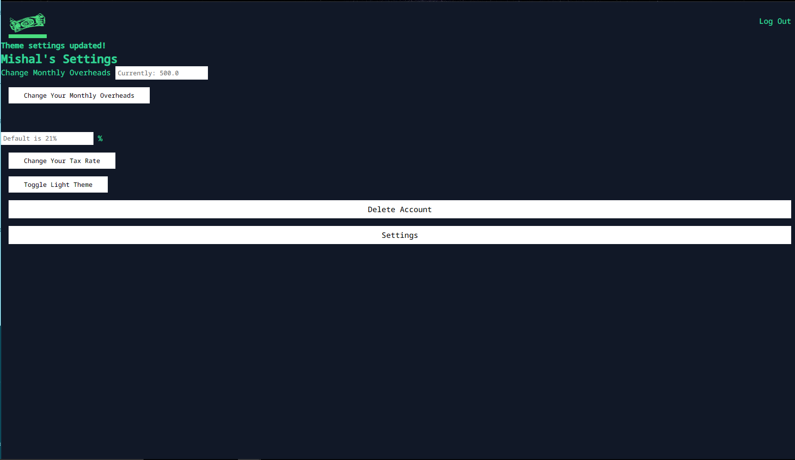
 
 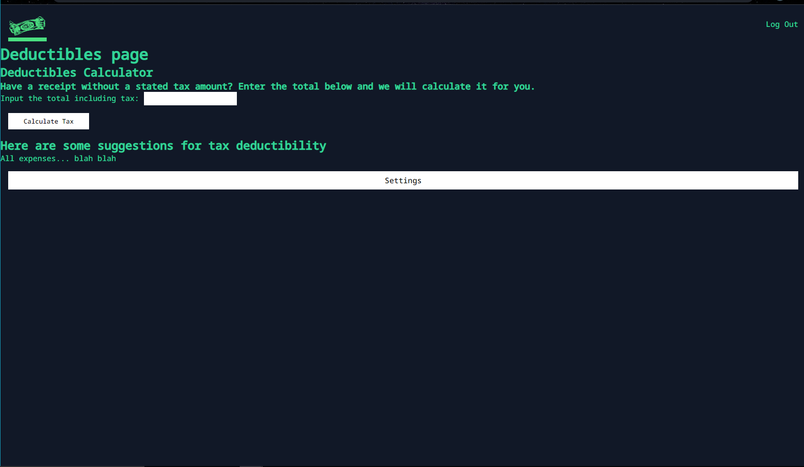

 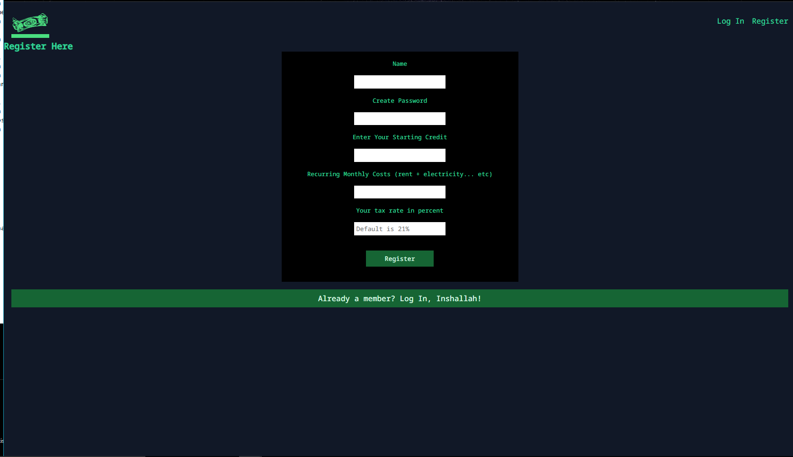

 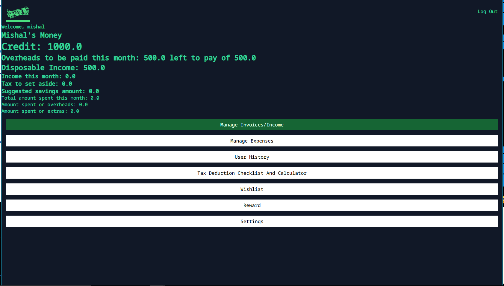

### Meeting With Mentor

At this point I met with my mentor, who gave some good feedback, and
some ideas how to streamline the application. This includes writing back-end
form validation, using better .update() methodology, as well as lots of other
smaller tips. Too many to mention, but all will be done before the styling.

### The Update Method

I took many naive routes to accomplish some basic actions. One of
which was using update_one repetitively to change the same database colletion.
This was also a good exercise in going through the code from a birdseye view.
Code at this length does seem to be a lot harder to read and get through than
when its under 500 lines.

### Redirect vs Render Template

I could at no point clearly comprehend the difference and application
of the two methods. This had in part to do with a misunderstanding of the 
correct syntax involved. For the whole project I had been using
redirect(url_for('')) which has a different application. Life would have been 
a lot easier if this was clearer from the start. 

### Add Delete Confirmation Pages

Previously I was of the mentality that the User should live 
dangerously. This means that the User had no safety net previously using the
app. In other words, the app deleted important things like your invoices,
expenses and your profile without any warning. Mentor warned against this.
Now the app sends the user to a confirmation page where the POST request
can be initiated. 

### Form Validation

Some kind of form validation is necessary to ensure that a user won't break 
the code with an irregular entry. While the html forms have some kind of
enforced formatting, the settings can be easily overridden. For this to work
some kind of conditional logic needs to check that the entries match certain 
limits. When they don't, a specific error message is returned that allows the
user to see exactly what it is that they need to fix in order for their input
to succeed. 

After looking at a sample function that the mentor had passed along, I
went ahead and started writing the code. Instead of creating a single form 
validator that could adapt to most of the forms (and since there are such
specific requirements that may require maintenance later) I decided
to go with a "per form" approach. 

### Limiting CRUD Functionality For Previous Months Income/Expense Records

Since the users finances are reset when a new month starts, it makes it easier
if users can no longer update or delete invoices or expenses once they are 
part of a previous months records. A datestamp was added that Jinja templating
checks against, then either allows or disallows the edit/delete buttons in the
relevant views.

### Extending User History To Include Previous Months & Tax Seasons

The User History page has so far been a history of incoming and outgoing money,
but it should also include the previous months and tax seasons. This allows 
the user to keep an eye on how much tax has been paid over the year, and how
their spending patterns have been. At the moment the page is an unbearable
mess of data, but I plan to organise it into neat sections that have
clear visual hierarchy and provide good feedback for a user.

### Last Check Before Styling

While I am certain that some things will need to be fixed in the 
backend of the project, the time is coming soon to submit the app. Further,
I took a peek at Django and finds it both interesting and quite
daunting, and would like to get to grips with it as soon as possible. For
a final check of functionality, there was relatively few things to sort out.
Mostly they were having lists in the correct order (for instance on the 
history page, showing from most recent instead of from the oldest).

### Design Ideas

I had the idea to make the app styled around Middle Eastern cultural
imagery, to a subtle extent. The intention is to provide a sense of protection
and support to a user, via personalising the app with an impressive and yet
benign Sheikh figure. So, while there will still be money green and bank black,
I am looking to include dark reds to increase the sense of gravity and
royalty. Red also adds some relief to the eye, as the contrast between green 
and black gets tiring after some time. As for the light theme, I am
not a light theme fan, so there is some difficulty of being sure whats best.
For the time being, the dark theme will be used as the reference, and once 
the imagery is all in place, the light theme will be worked on. 

Over to Figma now.

### The Design 

I began with an image and a layout, to get a sense of where to go:

 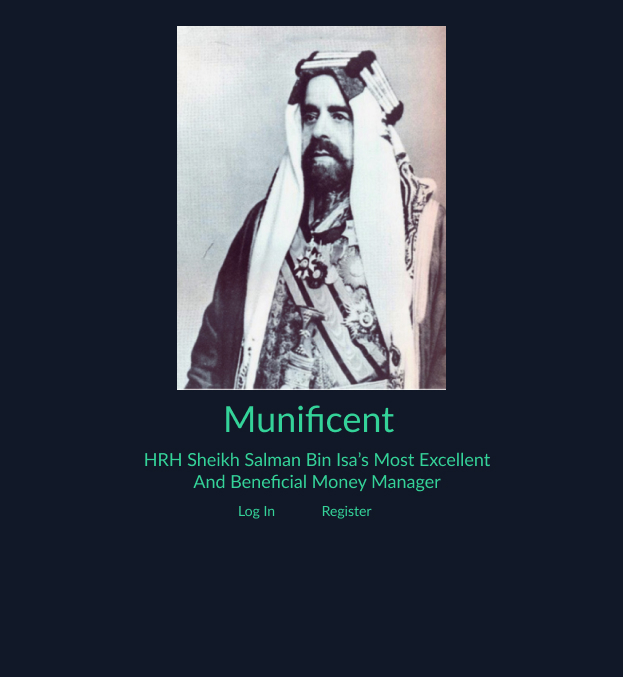

Which led to discovering some practical design problems. Firstly, the purpose 
of the app is to conveniently and quickly give the user important information.
The intention is not to create too many 'click-barriers', rather once the user
is logged in, everything is quick. Secondly, the user will sometimes switch to
the Dashboard view, which is highly detailed and complicated. Also the history
page. So the artistic direction should serve that purpose. 

By using the main image of Sheikh Salman as a background image with a very
reduced opacity, as well as a very dark grey background colour, the problem
was more or less solved. Text looks nice and readable, and the benign, regal
character of the Sheikh still comes through. 

For the buttons and input elements, there was some work put into picking the
right hues. A balance was found between richness and a muted quality which
somehow the app asks for. To some degree I feel that my styling
may leave something to be desired at the end of the process, but due to this
being so much outside my comfort zone, getting it good enough is the most
realistic option. 

A theme of btn-in btn-out and btn-manage colours was written into the html
and css from the start (with a vague idea of it coming in handy later). It
came in handy to create a realistic and limited palette for myself to
work on. Previously every design I made was haphazard in that 
regards, so something was learned there. 

A basic mockup of how the screen would look along with some elements:

 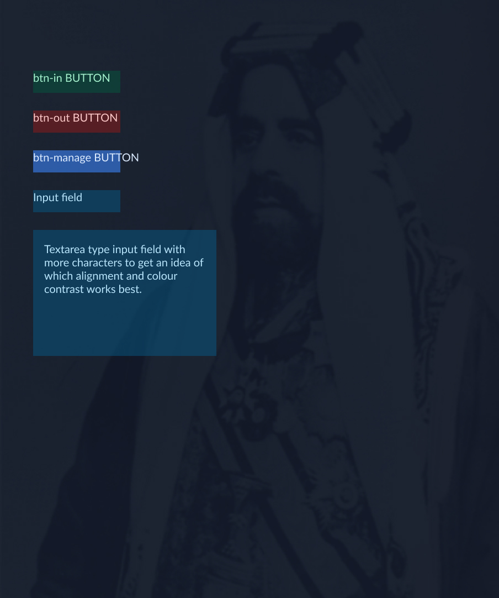

And a sheet with some numbers:

 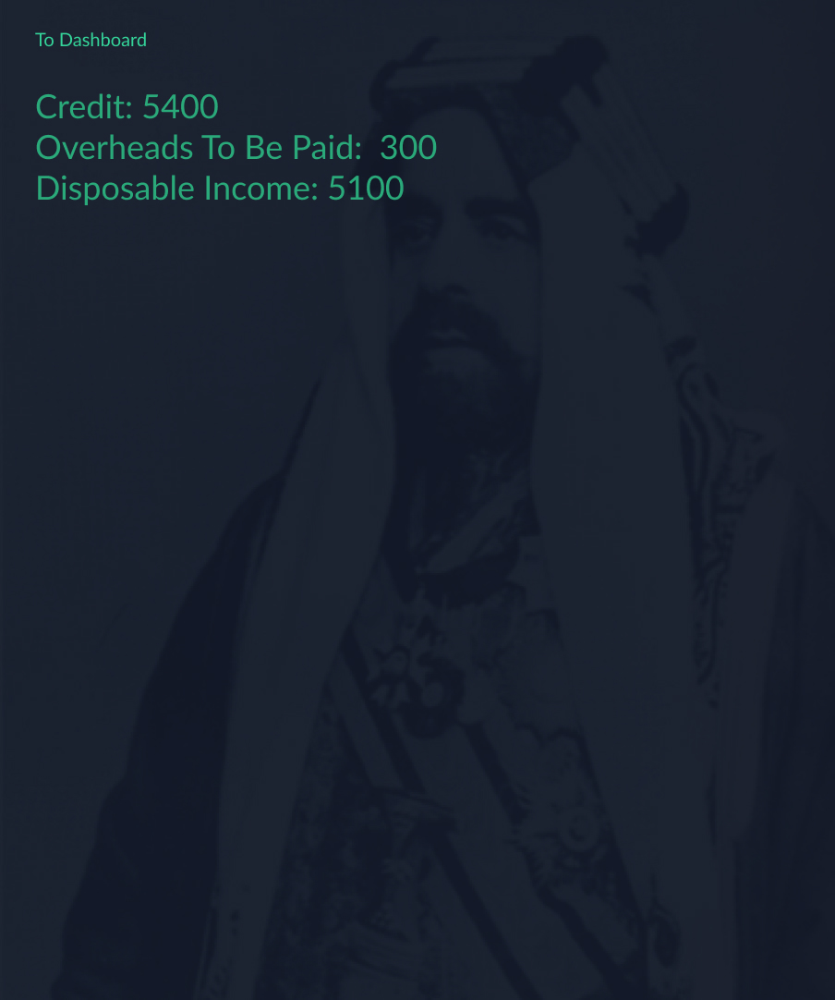

For the rest, I decided to try some interesting CSS mini-frameworks
to speed things along. These frameworks, including Water, Sakura and Marx are
named Classless frameworks as they style things according to the basic HTML.
They are to be placed early in the stylesheet sequence and then modified after
by the light/dark and general CSS sheets. 

### Water CSS

After trying a few options, the Water framework had the best effect on the 
site in my opinion, so the CDN was added. There is a nice centering
of content, plenty of whitespace and generally a feeling of comfort to using
it. A few things will need to be overridden, but generally its okay.

### Button Styling And Conflicts

Some hours were spent styling the buttons to the appropriate colour and size.
It seems a one-size fits all approach is not going to work, and sizing buttons
per page would be a very long task. On some pages the alignment of the buttons
is in conflict with the alignment of the forms. For the most part it is 
acceptable, and I am anxious to style the tables for the History 
page. I expect that to be a challenge of navigating Jinja templates 
and HTML/CSS structures.

### Ending The Styling Process

At a certain point, things reached a stable state and the visuals were less
obtrusive, and more in tune with my own sensibilities. The app does
not look like something the bank made to "increase user engagement", but, in 
my opinion, it looks rather like something coming from "us" as normal
everyday people. At least this is the closest that I can simulate of 
my conceptual intent. 

### Writing A User Manual

During the app creation process, I started a .md file that would keep
track of the features and explain them for a new user. It was first written in
a quasi-humourous style, but then I felt it best to just write it as
straightforwardly as possible. The intended user is a person who would feel 
overwhelmed at first by a lot of these ideas and features, and it is hoped 
that the overall tone of the user documents be welcoming, soothing and
 also confidence-inspiring. 

### Commenting CSS And HTML

The commenting process of the CSS and HTML was done for the sake of future
maintainability. The idea that I had, in general when it comes to
documentation, is that someone who cannot understand code can still follow
along with every step of the way. Of course they would have to be patient and
willing to follow along, but this also makes it easier for even myself in
the future to find sections and change them if necessary.

### User Stories?

When the app was begun, the main overarching goal was to create something
that had a simple function without compromising on important auxilliary
aspects. The user should spend about two to three minutes getting the basic
idea of the app, and then from there spend a little time getting things set 
up. These steps, generally speaking, were the big hurdle in getting people
to try the app. The intial investment, however short, is a bit of a bitter 
pill. However, in the case of every person who tried the app, after the intial
setup, the ease of use was remarked on. 

There is no real way to pass over the important details when it comes to money
management - in the interest of keeping things simple, you have to work almost
harder on the reliability and scalability of the apps function. So in some ways
the app is a 'success', provided the user is willing to invest a few minutes of 
their time into the setup process. However, the app cannot guarantee a helpful
purpose otherwise. It may turn out to be a nuisance rather than a help, for the
wrong user. 

The successful part, lots of whitespace and clarity:

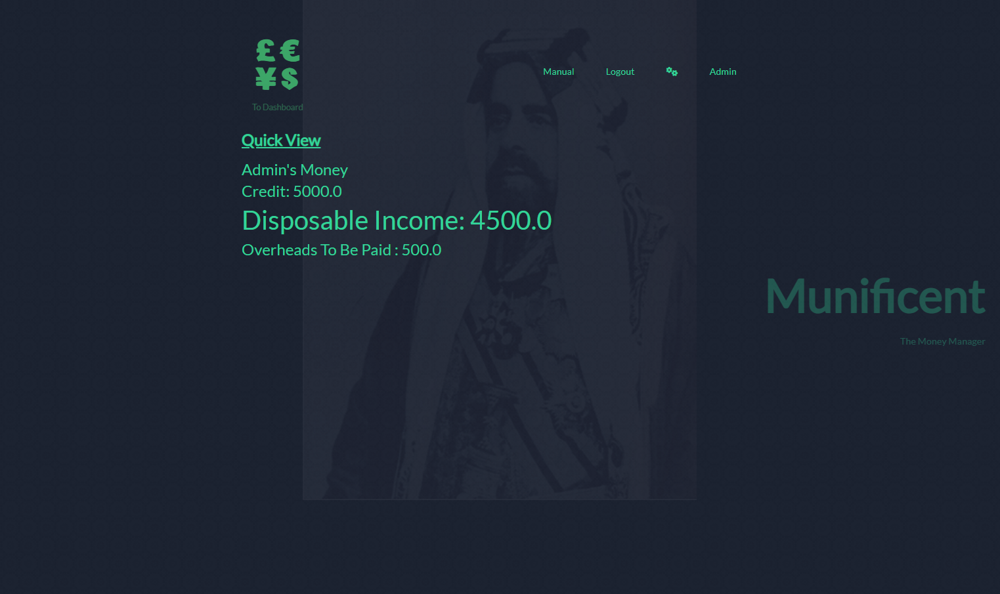

 The hinge that determines whether the app is ultimately useful to you or
 not (the manual):

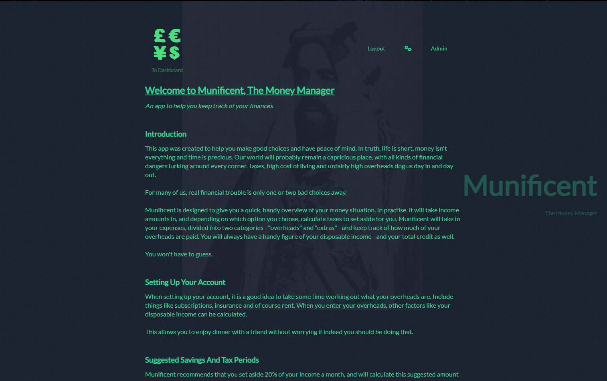

 The app at its most complex, the Dashboard:

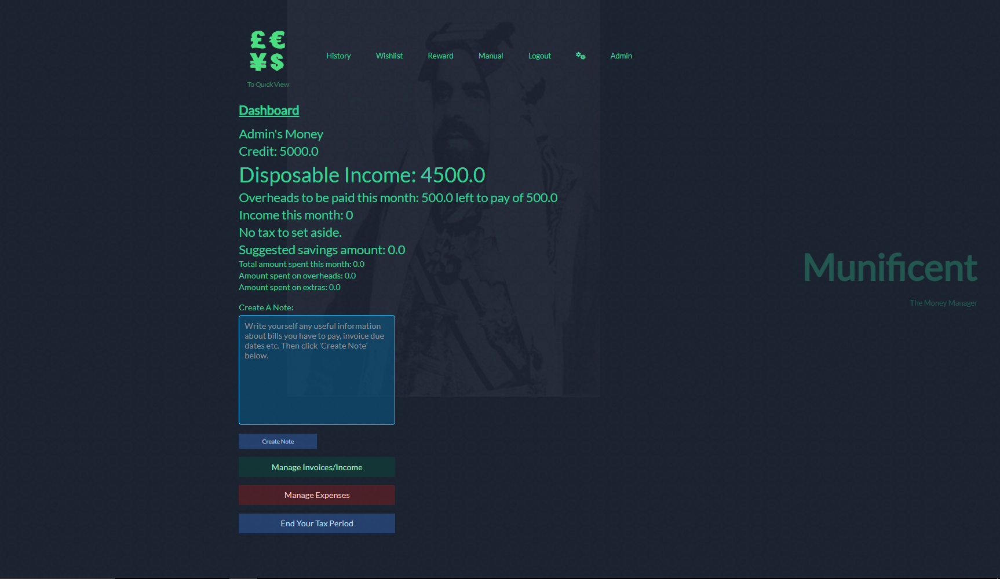

  Important functionality in users control:

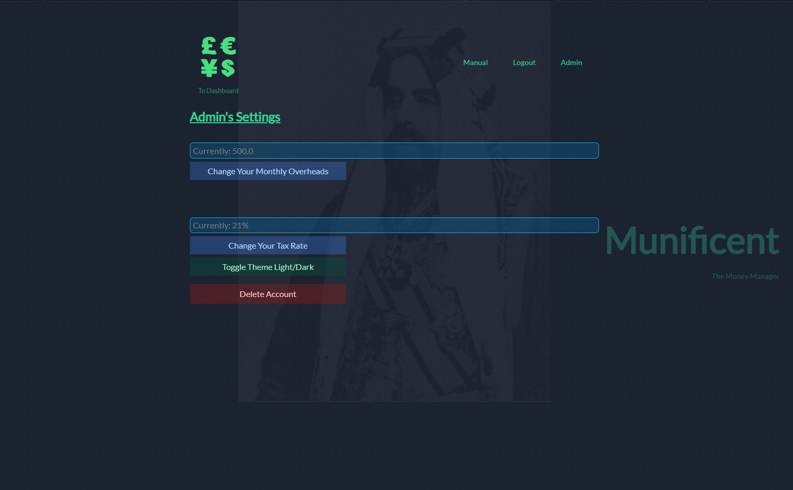

These images give me some assurance that while Munificent has a little 
complexity underneath the hood, the choice to have a simpler interface allows
the user to have a quick and useful experience. There are no click barriers 
to the Quick View from the moment of logging in - its the first port of call
for the app. If the user needs to do something more nitpicky, they can sit down
and with one click navigate to a comprehensive dashboard. After that, all the
functions are easily available. 

### Thoughts About Documentation Approach

The unconventional documentation approach taken this time had its moments. 
Namely, the best thing about it was realising that sometimes my 
technical intent was not really clear. It was helpful to write down first
what the intention to achieve was, as clearly as possible. This actually led
to many moments of insight into how to progress. It abstracted away any limits
on the part of my technical ability, which is a huge impediment, and
let the emphasis lie on what the desired outcome was, functionally.

You hear it said in the software world often: "Our job is not to write fancy
code but to solve real world problems". 

It seems that taking that approach to heart means you also can learn a lot 
really quickly. Once you identify clearly the problem you want to solve, a 
quick Google search and some trial and error means a lot can be done with
confidence in the end result.

The drawbacks were that sometimes it was difficult to keep the process so 
linear. You could say that there was quite a lot of "asynchronous" coding
going on. While updating the app.py functionality, a style issue had to be 
resolved. While going through an endless series of tests, in particular, I 
simply had to create an admin page just to be able to delete all the
accounts cluttering up the database with outdated schematics.

This led to sneaky commits that didn't include all the functionality done. The
character limit on the commit messages aside, I often felt that the
small things here and there didn't really always merit a mention. Spelling
mistakes, or changing a render_template to a redirect, for example.

### Thoughts On Flask/The Project After A Quick Look At Django

Django is undoubtedly a very big deal and a very handy tool. After learning a 
little bit about the setup system and package-oriented approach from the 
Django module, coming back to Flask was interesting. 

Munificent was written somewhat in a monolithic style - one large "app.py" and
a small "utils.py". The if name equals main part is on the same page, all the
imports and secondary functions (more or less) as well. This was really a 
pain to navigate through when wanting to crossreference functions. 

Also, writing forms directly in the HTML is fussy and insecure. I
was a bit too far into the project when I discovered WTForms, which would
have made it all a lot more fun and easier to test, also to prepare for 
Django - which has a similar function built-in.

Coming to some familiarity with basic Flask concepts made the core concepts
regarding "the backend" clearer for myself. Sometimes there is some 
confusion, it is suspected that many are confused and there is often a misuse
of the term even by professionals. There is much less of that, and I
am less stressed by the thought of "which backend framework should I learn",
considering that the basic concepts are the same and its mostly a matter of
syntax and conventions.

Overall a pivotal and interesting learning experience with an end result that
is hoped will help a rather blank CV, considering I have been a cook,
baker and musician my whole adult life. 

